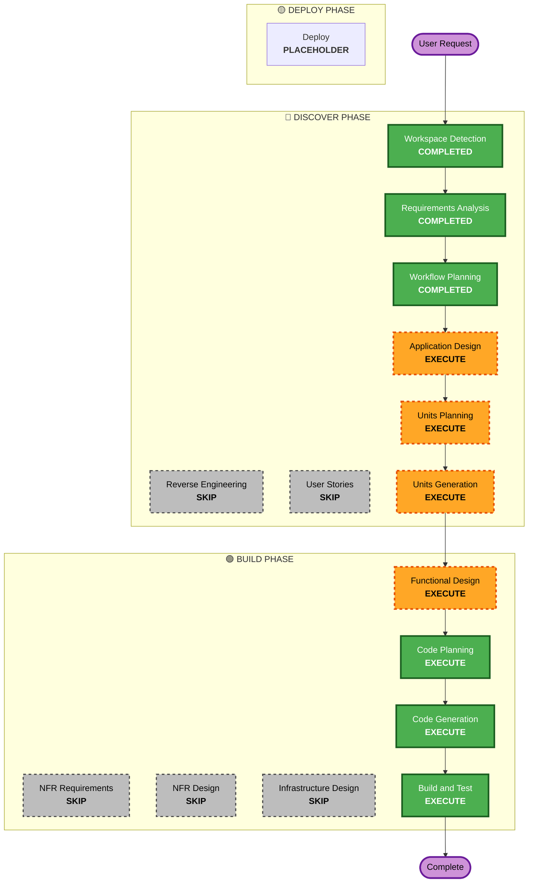

# Execution Plan

## Detailed Analysis Summary

### Change Impact Assessment
- **User-facing changes**: Yes - Complete creation of new front-end App and Admin flow.
- **Structural changes**: Yes - Implementation of new architecture from scratch.
- **Data model changes**: Yes - Creation of new tables for users, products, cart, and orders.
- **API changes**: Yes - Definition and creation of all new REST endpoints.
- **NFR impact**: Yes - Scalable schema design, premium UI constraints execution.

### Risk Assessment
- **Risk Level**: Low (Greenfield)
- **Rollback Complexity**: Easy (Git commits/branches context)
- **Testing Complexity**: Simple (Standard API testing and core flow assertion)

## Workflow Visualization

## Phases to Execute

### 🔵 DISCOVER PHASE
- [x] Workspace Detection (COMPLETED)
- [x] Reverse Engineering (SKIPPED)
- [x] Requirements Elaboration (COMPLETED)
- [x] User Stories (SKIPPED)
- [x] Execution Plan (COMPLETED)
- [ ] Application Design - EXECUTE
  - **Rationale**: Need to formalize core modules (Authentication, Product Catalog, Cart, Checkout, Order, Admin).
- [ ] Units Planning - EXECUTE
  - **Rationale**: Data models (DB schemas) and API interfaces need planning details.
- [ ] Units Generation - EXECUTE
  - **Rationale**: Essential breakdown for code planning.

### 🟢 BUILD PHASE
- [ ] Functional Design - EXECUTE
  - **Rationale**: To translate planned units into functional actions for developers to build state flows.
- [ ] NFR Requirements - SKIP
  - **Rationale**: Defined to stay strictly focused on minimal necessary tech without over-engineering logic or advanced caching.
- [ ] NFR Design - SKIP
  - **Rationale**: Skipped per NFR Requirements.
- [ ] Infrastructure Design - SKIP
  - **Rationale**: Simple standard deployment model for FastAPI and Next.js, no specialized Cloud design needed for MVP.
- [ ] Code Planning - EXECUTE (ALWAYS)
  - **Rationale**: Implementation approach needed.
- [ ] Code Generation - EXECUTE (ALWAYS)
  - **Rationale**: Code implementation needed.
- [ ] Build and Test - EXECUTE (ALWAYS)
  - **Rationale**: Verification is needed.

### 🟡 DEPLOY PHASE
- [ ] Deploy - PLACEHOLDER
  - **Rationale**: General deployment setup.

## Estimated Timeline
- **Total Phases**: 9 Active Executable Phases
- **Estimated Duration**: ~1 Day equivalent scope

## Success Criteria
- **Primary Goal**: Fully functioning and tested core flow (Auth -> Products -> Cart -> Checkout -> Orders).
- **Key Deliverables**: A clean UI Frontend and a mapped FastAPI backend conforming to rules.
- **Quality Gates**: All code is rigorously generated complying with strict anti-over-engineering rules and minimal API needs.
